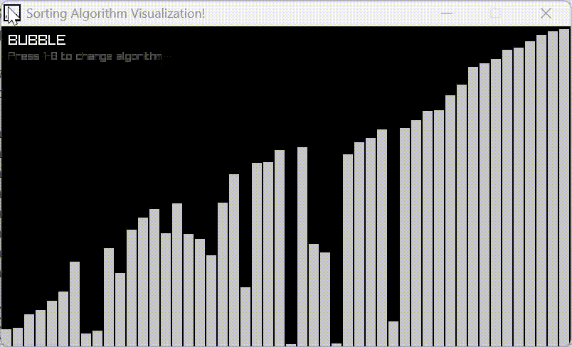

# 🎨 Sorting Algorithm Visualizer

A real-time sorting algorithm visualization tool built with C++ and Raylib. Watch different sorting algorithms in action with colorful, step-by-step animations!


## 🎥 Demo



## ✨ Features

- **8 Classic Sorting Algorithms** implemented with step-by-step visualization
- **Real-time Animation** showing comparisons, swaps, and movements
- **Color-coded Operations** for easy understanding:
  - 🔴 **Red**: Elements being compared
  - 🔵 **Blue**: Special markers (pivot, minimum, etc.)
  - 🟢 **Green**: Sorted elements (Heap Sort)
  - ⚪ **Gray**: Unsorted elements
- **Interactive Controls** - Switch between algorithms on the fly
- **Smooth 60 FPS** rendering for fluid animations

## 🎯 Supported Algorithms

| # | Algorithm | Time Complexity (Avg) | Space Complexity | Key Feature |
|---|-----------|----------------------|------------------|-------------|
| 1 | **Bubble Sort** | O(n²) | O(1) | Adjacent element swapping |
| 2 | **Selection Sort** | O(n²) | O(1) | Finding minimum repeatedly |
| 3 | **Insertion Sort** | O(n²) | O(1) | Building sorted array incrementally |
| 4 | **Quick Sort** | O(n log n) | O(log n) | Divide and conquer with pivot |
| 5 | **Merge Sort** | O(n log n) | O(n) | Divide and conquer with merging |
| 6 | **Heap Sort** | O(n log n) | O(1) | Binary heap-based sorting |
| 7 | **Shell Sort** | O(n log²n) | O(1) | Gap-based insertion sort |
| 8 | **Counting Sort** | O(n + k) | O(k) | Non-comparison integer sort |

## 🚀 Getting Started

### Prerequisites

- **C++ Compiler** (GCC, Clang, or MSVC)
- **Raylib** library ([Installation Guide](https://github.com/raysan5/raylib#build-and-installation))

### Installation

1. **Clone the repository**
```bash
git clone https://github.com/yourusername/sorting-visualizer.git
cd sorting-visualizer
```

2. **Install Raylib** (if not already installed)

**Linux/macOS:**
```bash
# Using package manager
sudo apt install libraylib-dev  # Ubuntu/Debian
brew install raylib             # macOS

# Or build from source
git clone https://github.com/raysan5/raylib.git
cd raylib/src
make PLATFORM=PLATFORM_DESKTOP
sudo make install
```

**Windows:**
- Download from [Raylib Releases](https://github.com/raysan5/raylib/releases)
- Follow the [Windows Installation Guide](https://github.com/raysan5/raylib/wiki/Working-on-Windows)

3. **Compile the project**
```bash
# Linux/macOS
g++ main.cpp -o sorting_visualizer -lraylib -lGL -lm -lpthread -ldl -lrt -lX11

# Windows (MinGW)
g++ main.cpp -o sorting_visualizer.exe -lraylib -lopengl32 -lgdi32 -lwinmm

# Or import into Notepad++ and run F6
```

4. **Run the visualizer**
```bash
./sorting_visualizer          # Linux/macOS
sorting_visualizer.exe        # Windows
```

## 🎮 Controls

| Key | Algorithm |
|-----|-----------|
| `1` | Bubble Sort |
| `2` | Selection Sort |
| `3` | Insertion Sort |
| `4` | Quick Sort |
| `5` | Merge Sort |
| `6` | Heap Sort |
| `7` | Shell Sort |
| `8` | Counting Sort |

Press any number key to switch algorithms. The array will automatically regenerate with random values.

## 📊 Understanding the Visualization

### Color Meanings:
- **Red bars**: Currently being compared or processed
- **Blue bars**: Special elements (pivot in Quick Sort, minimum in Selection Sort, etc.)
- **Green bars**: Elements in their final sorted position (Heap Sort)
- **Light gray bars**: Unsorted elements

### How It Works:
Each sorting function performs one small step per frame, allowing you to see:
- Which elements are being compared
- When swaps occur
- How the algorithm progresses through the array
- The final sorted result

## 🔧 Configuration

You can customize the visualization by modifying these constants in `main.cpp`:

```cpp
#define NUM_BARS 50           // Number of bars to sort (10-100 recommended)
#define WINDOWS_WIDTH 800     // Window width in pixels
#define WINDOWS_HEIGHT 450    // Window height in pixels
```

To adjust the speed, modify the FPS:
```cpp
SetTargetFPS(60);  // Increase for faster, decrease for slower
```

## 📚 Algorithm Details

### Bubble Sort
The simplest sorting algorithm that repeatedly steps through the list, compares adjacent elements, and swaps them if they're in the wrong order.

### Selection Sort
Finds the minimum element from the unsorted portion and places it at the beginning. Blue highlights the current minimum.

### Insertion Sort
Builds the final sorted array one item at a time, inserting each element into its correct position.

### Quick Sort
Efficient divide-and-conquer algorithm using a pivot (shown in blue) to partition the array.

### Merge Sort
Divides the array into halves recursively, then merges them back in sorted order. Red and blue show the two subarrays being merged.

### Heap Sort
Converts the array into a max heap structure, then repeatedly extracts the maximum. Green shows sorted elements.

### Shell Sort
An optimization of insertion sort that allows exchanges of far-apart elements, using diminishing gap sequences.

### Counting Sort
Non-comparison sort that counts occurrences of each value. Works efficiently for integer arrays with limited range.

## 🐛 Known Issues & Limitations

- Counting Sort requires bars with heights from 0 to `WINDOWS_HEIGHT`
- The color changes happen too fast within each frame in counting sort, and we're not giving enough time to see the comparisons and placements. 
- Very large arrays (>200 bars) may slow down visualization
- Static variables are used for step-by-step progression

